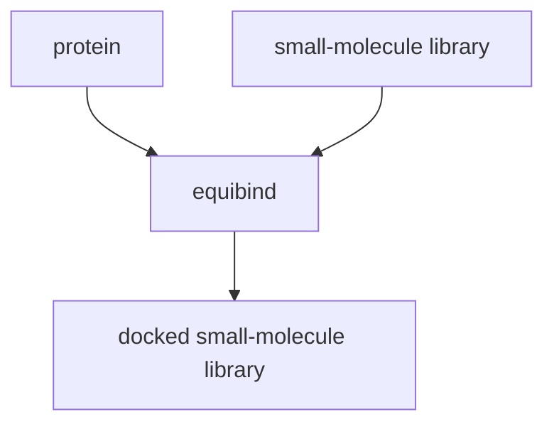

[github](https://github.com/openlab-apps/equibind), [pdf](https://arxiv.org/pdf/2202.05146.pdf), [talk](https://www.youtube.com/watch?v=JAvh9e6XEGM)
join the [small molecule chat](https://t.me/+3Mu6kERdgKgyNTAy)
follow the [author](https://twitter.com/HannesStaerk)

```
Stärk, H., Ganea, O.-E., Pattanaik, L., Barzilay, R. & Jaakkola, T. EquiBind: Geometric Deep Learning for Drug Binding Structure Prediction. _arXiv [q-bio.BM]_ (2022)
```

## Visual Abstract
![[Pasted image 20221207115022.png]]
## Introduction
Equibind predicts possible [[small molecule protein interaction]] poses when provided a [[protein.pdb]] and a [[small-molecule library]]. This task of predicting the 3D structure of a protein / small-molecule interaction is referred to as [[blind docking]]. Equibind is reducing the time to generate a pose by up to 1000x compared to existing tools such as [[Quickvina Wide]]. 


## Process


## Input
LabDAO is maintaining a multi-ligand docking implementation of equibind. The inputs are the protein structure as a [[protein.pdb]] file and a [[small-molecule library]].

Equibind generates conformers for every small molecule within the library and is moving it in 3D space relative to the provided protein structure.

## Output
The model outputs a [[docked small-molecule library]] file with each structure moved in 3D space relative to the target protein. To interpret the result, visualise the structures together with the target protein.

Equibind only generates potential poses for a protein / small-molecule interaction. It does not score these interactions. 

## Benchmark 
*coming soon*

## Access
Run on [bacalhau](https://docs.bacalhau.org/)
```
# please note that bacalhau currently only supports one mounted IPFS file; in this case we provide a protein structure, called test.pdb, via IPFS.
bacalhau docker run -i bafybeico6n7wgydwaigcnvkrojldc2hk5dbxqp66ezjw5ytis2irq7k2pm ghcr.io/labdao-apps/equibind:main -- python main.py --protein /inputs/test.pdb --small_molecule_library /src/test/test.sdf
```

Run locally
```
# pulling the container
docker pull ghcr.io/labdao-apps/equibind:main

# running the container
docker run -v /Users/rindtorff/zettelkasten/labdao/equibind/test:/inputs -v /Users/rindtorff/Desktop:/outputs ghcr.io/labdao-apps/equibind:main python main.py --protein /inputs/test.pdb --small_molecule_library /inputs/test.sdfdocker
```


